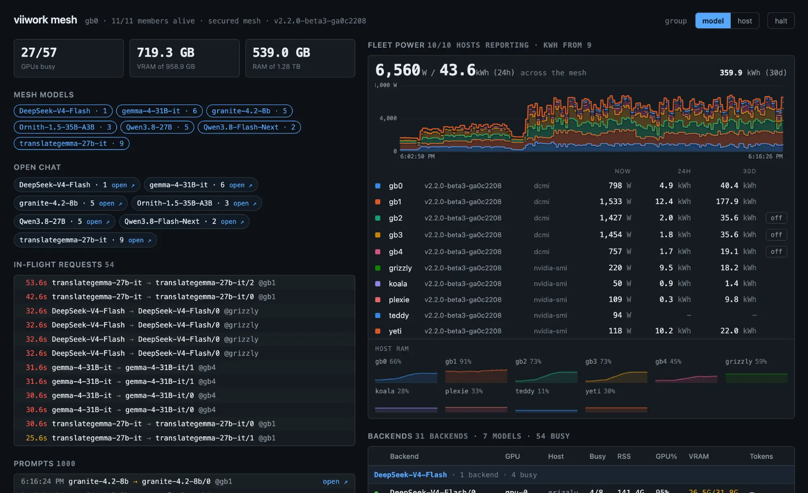

# viiwork

**LLM inference for a fleet of machines.** One node per machine serves every
model on it behind one OpenAI-compatible API. Nodes find each other and form a
mesh; any node is an entry point, and a request goes to a free slot wherever
one exists.



## Background

I had 50 Radeon VII cards sitting in servers in my mother-in-law's garage (who
doesn't?) and wanted to do something useful with them. viiwork turns a pile of
aging-but-capable GPUs into a practical inference cluster.

That fleet is still the reference deployment, but viiwork runs on anything from
one gaming GPU to racks of cards — AMD, NVIDIA or an Apple Silicon Mac, all in
one mesh. It doesn't do inference itself: it drives existing engines —
llama.cpp, vLLM, FreeToken and Strata — and turns them into one fleet. Each node's
GPU resources are available from any endpoint.

## What you get

| | |
|---|---|
| One API per machine | Every model on the box on port 8086 → [configuration](docs/configuration.md) |
| Four engines | llama.cpp, vLLM, FreeToken, Strata side by side → [models](docs/models.md) |
| Self-assembling mesh | No peer lists; routes to whoever has a free slot → [mesh](docs/mesh.md) |
| Aliases | Stable names like `stable-coder`, switched once for the fleet → [aliases](docs/mesh.md#aliases) |
| Dashboards | Models, jobs, backends, prompts, power → [dashboards](docs/dashboards.md) |
| `viiwork top` | The mesh live in a terminal → [operations](docs/operations.md#watching-the-mesh-viiwork-top) |
| Power and cost | Wattage, spot price, per-model kWh → [power and energy](docs/power-and-energy.md) |
| Pipelines | Several LLM steps as one model name → [pipelines](docs/configuration.md#pipelines) |
| MCP server | The cluster as tools for assistants → [MCP](docs/operations.md#mcp-server) |
| Autodiscovery | Coding clients find models and context on their own → [autodiscovery](docs/autodiscovery.md) |

## Quick Start

You need GGUF model files and one of:

| Hardware | What the wizard does |
|---|---|
| **Radeon VII / MI50 / MI60** (gfx906), Linux + Docker | Writes the config; you build and start the image (below) |
| **NVIDIA**, Linux + Docker + NVIDIA Container Toolkit | Writes the config and starts the node |
| **Apple Silicon Mac** | Writes the config and starts the node natively |

Full requirements: [setup](docs/setup.md#before-you-start).

```bash
v=vX.Y.Z                     # newest from https://github.com/janit/viiwork/releases
os=linux_amd64               # or linux_arm64, darwin_arm64
base=https://github.com/janit/viiwork/releases/download/$v
curl -fLO "$base/viiwork_${v}_${os}.tar.gz" -fLO "$base/SHA256SUMS"
sha256sum --check --ignore-missing SHA256SUMS    # Mac: shasum -a 256 --check ...
tar xzf "viiwork_${v}_${os}.tar.gz" && cd "viiwork_${v}_${os}"

sudo ./viiwork init          # Mac: ./viiwork init
```

The wizard finds your GPUs and models, proposes a layout, and shows every file
before writing anything. → [setup](docs/setup.md) ·
[verifying signatures](docs/releases.md#checking-a-download-by-hand)

**On gfx906**, build the image from the same release and start it:

```bash
git clone https://github.com/janit/viiwork && cd viiwork && git checkout "$v"
make docker
sudo cp configs/docker-compose.v2.example.yaml /etc/viiwork/docker-compose.yaml
# set the models mount in that file, then:
sudo docker compose -f /etc/viiwork/docker-compose.yaml -p viiwork up -d
```

→ [when it writes the config only](docs/setup.md#when-it-writes-the-config-only)

**Add the next machine:** print a join code on any node, run the wizard on the
new one, paste the code. The code is the mesh secret.

```bash
sudo sh -c 'set -a; . /etc/viiwork/mesh.env; /usr/local/bin/viiwork join-code'   # Linux
~/.local/bin/viiwork join-code                                                    # Mac
```

**Test it:**

```bash
curl http://localhost:8086/v1/models
curl http://localhost:8086/v1/chat/completions -H "Content-Type: application/json" \
  -d '{"model":"<name from /v1/models>","messages":[{"role":"user","content":"Hello"}]}'
```

**Day to day:** `viiwork top`, `viiwork update` ([updating](docs/setup.md#updating)),
`viiwork stop` / `start`, `viiwork uninstall` (keeps your models).

### By hand

Skip the wizard: copy `viiwork.yaml.example` to `/etc/viiwork/viiwork.yaml`,
put a `VIIWORK_MESH_SECRET` in `/etc/viiwork/mesh.env` (or set `mesh.open: true`),
then build and start the image as above.
→ [configuration](docs/configuration.md)

## Configuration

One file per machine. Each model has a name, its GPUs and its slots:

```yaml
models:
  - name: Qwen3.8-27B
    engine: llamacpp
    path: /models/Qwen3.8-27B-UD-Q4_K_XL.gguf
    gpus: [0, 1]
    gpus_per_backend: 2      # one backend across both cards
    context: 49152           # tokens PER SLOT
    parallel: 2
```

- A GPU belongs to one model
- `SIGHUP` reloads: added models start, removed drain, changed restart
- Validated at startup and reload, errors name the field

→ [docs/configuration.md](docs/configuration.md)

## The mesh

- **Ports:** 8086 tcp (API, dashboards), 7946 tcp+udp (gossip)
- **Discovery:** Tailscale (default) or LAN mDNS; optional seeds
- **Secured or open:** set `VIIWORK_MESH_SECRET`, or declare `mesh.open: true`
- **Routing:** local free slot → member with most free slots → queue (20 s)

→ [docs/mesh.md](docs/mesh.md)

## Dashboards

| Page | What it is |
|---|---|
| `/` | This node |
| `/mesh` | The whole cluster, from any node |
| `/chat` | Chat UI (`?model=&host=`) |
| `/prompt` | One request's prompt and output |

→ [docs/dashboards.md](docs/dashboards.md)

## Engines

| Engine | Runs | Shape |
|---|---|---|
| `llamacpp` | `llama-server` (reference) | CPU or GPU |
| `vllm` | `vllm serve` | tensor-parallel across its cards |
| `freetoken` | `ft serve` | one card per process, MoE experts in host RAM |
| `strata` | `python -m serve.server` (Strata) | one model family, layers split across a backend's cards |

All four can run on one node. Adding an engine is one package plus one line.
→ [docs/adding-an-engine.md](docs/adding-an-engine.md)

## Models and hardware

- **gfx906 rule:** a dense model that doesn't fit one card costs ~3× throughput
- **FreeToken exception:** big sparse MoE models on a single card, at the cost
  of load time
- **Strata:** one sparse MoE family (Qwen3.8-Flash-Next) with its layers split
  across a backend's cards and the experts in host RAM; runs on gfx906 →
  [models](docs/models.md#strata-one-moe-family-across-several-cards)

What the Radeon VII hosts serve today:

| Model | Hosts | Context per slot | Role |
|---|---|---|---|
| `Qwen3.8-27B` | 2 | 49152 | coder and prose |
| `granite-4.2-8b` | 2 | 16384 | fast utility |
| `translategemma-27b-it` | 3 | 4096 | translation |
| `gemma-4-31B-it` | 3 | 6144 | prose |
| `Ornith-1.5-35B-A3B` | 1 | 262144 | long context |

Throughput, validated configs, failed bring-ups, tuning rules →
[docs/models.md](docs/models.md)

## Security

**viiwork authenticates nothing.** Reachability is the authorization; run it on
a tailnet. A CORS allowlist (default: your own tailnet) stops browser pages
driving the fleet. → [docs/security.md](docs/security.md)

## API

| Endpoint | What |
|---|---|
| `/v1/chat/completions`, `/v1/completions`, `/v1/embeddings` | Inference, routed by model (`?host=` pins a node, `?prefer=` names favourites) |
| `/v1/models` | Every model in the mesh, with context length |
| `/health` | Node health |
| `/v1/capacity`, `/v1/fleet/capacity` | Slots and load, this node or the whole mesh |
| `/v1/status`, `/v1/cluster` | Node and member state |
| `/api.json`, `/v1/model/info` | Discovery for OpenCode and Roo Code |

→ [docs/api-integration.md](docs/api-integration.md)

## Builds

| Image | Engine | Make target |
|---|---|---|
| `viiwork` | `llamacpp` on ROCm / gfx906 | `make docker` |
| `viiwork-vllm` | `vllm` | `make docker-vllm` |
| `viiwork-freetoken` | `freetoken` | `make docker-freetoken` |
| `viiwork-strata` | `strata` on ROCm / gfx906 | `make docker-strata` |
| `viiwork-strata-cuda` | `strata` on CUDA | `make docker-strata-cuda` |

Releases also ship signed static binaries for linux/amd64, linux/arm64 and
darwin/arm64. → [BUILDS.md](BUILDS.md) · [docs/releases.md](docs/releases.md)

## Documentation

| Document | About |
|---|---|
| [setup.md](docs/setup.md) | First-run wizard, join codes, updating, uninstalling |
| [configuration.md](docs/configuration.md) | Every config key |
| [mesh.md](docs/mesh.md) | Discovery, security modes, routing, aliases |
| [models.md](docs/models.md) | Measured catalogue and gfx906 tuning |
| [dashboards.md](docs/dashboards.md) | The web pages |
| [api-integration.md](docs/api-integration.md) | Full API reference |
| [autodiscovery.md](docs/autodiscovery.md) | Clients discovering the fleet |
| [consuming-fleet-capacity.md](docs/consuming-fleet-capacity.md) | Clients reacting to capacity |
| [operations.md](docs/operations.md) | Scripts, acceptance checks, `viiwork top`, MCP |
| [power-and-energy.md](docs/power-and-energy.md) | Power, cost, energy store, IPMI |
| [security.md](docs/security.md) | Trust model and CORS |
| [releases.md](docs/releases.md) | Verifying, updating, publishing |
| [macos.md](docs/macos.md) | A Mac as a node |
| [thinking-models.md](docs/thinking-models.md) | Controlling reasoning output |
| [adding-an-engine.md](docs/adding-an-engine.md) | The engine contract |
| [energy-store-format.md](docs/energy-store-format.md) | Energy file format |
| [tensor-split-design.md](docs/tensor-split-design.md) | Multi-GPU backends |
| [migrating-to-v2.md](docs/migrating-to-v2.md) | v1 → v2 |
| [BUILDS.md](BUILDS.md) | Images and pins |

## Development

```bash
make build        # binary
make test         # unit tests
make docker       # ROCm image
go test -tags=integration ./mesh/... ./internal/proxy/ ./internal/alias/ ./internal/node/   # multi-node, no GPU
go test -bench=. -benchmem ./internal/proxy ./internal/route                                 # compare allocs, not time
```

Go 1.27.1. Dependencies: `yaml.v3`, `memberlist`, `mdns`, `x/term`.
